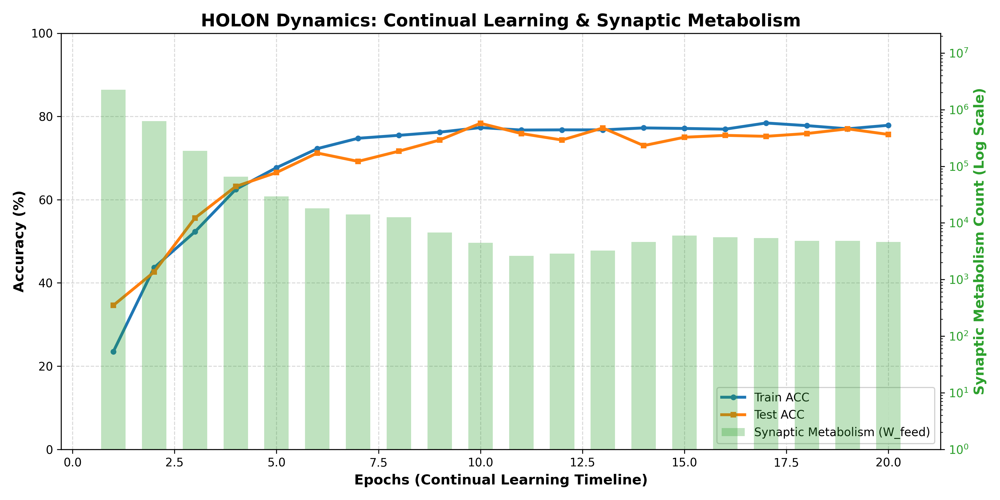
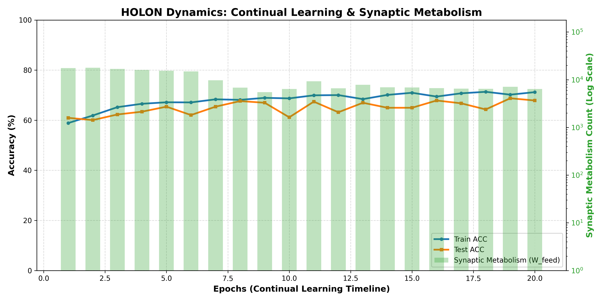

# Project HOLON
**A 100% BP-Free, Continual Learning Neural Architecture based on the Free Energy Principle**

Project HOLON is an autonomous, biologically plausible neural network designed to overcome the fundamental limitations of modern Deep Learning—specifically **Catastrophic Forgetting** and the inability to **Extrapolate (Out-of-Distribution adaptation)**. 

By completely eliminating Backpropagation (BP) and tokenizers, HOLON operates directly on **Raw Byte Streams**, learning temporal and spatial meta-structures through local Hebbian rules, predictive coding, and synaptic metabolism.

## Core Philosophy
Mainstream AI separates "learning" from "inference." Project HOLON bridges this gap. 
We view intelligence not as a static mapping of inputs to outputs, but as a dynamic equilibrium occurring at the "present" moment—sandwiched between **consistency from the past (Horizontal recurrent waves)** and **beliefs/hallucinations about the future (Top-down predictive coding)**. 

In HOLON, concepts like "personality" or "ego" are not hardcoded modules but emergent phenomena arising from this continuous spatiotemporal tension.

**Hardware-Ready, Edge-Native, and Modality-Agnostic:**  
HOLON is fundamentally designed with hardware implementation (e.g., FPGA, Neuromorphic chips) in mind. By relying entirely on 256-dimensional Raw Byte Streams and purely local computing—completely eliminating the massive memory overhead and global gradient broadcasts required by Backpropagation—the core matrix operations can be seamlessly mapped onto resource-constrained edge devices. 
Furthermore, because it processes raw bytes rather than semantic tokens, **extending HOLON to multi-modal inputs (e.g., audio, sensor data, binary streams) is inherently seamless.**

## Key Features
* **100% BP-Free Local Learning:** Uses Novelty-Gated Oja's rule and Hebbian Gating. Weights are updated purely locally in linear time and constant memory.
* **Continual Learning (Zero Catastrophic Forgetting):** Adapts to new, unseen rules on the fly while perfectly retaining previously learned contexts.
* **Synaptic Metabolism:** Weak connections are autonomously pruned and randomly regenerated based on Surprise (L1 prediction error).
* **Hierarchical Surprise Reset:** Upper layers reset their context upon detecting major topic changes, while lower layers retain short-term working memory.
* **Precision-Weighted Hallucination:** Top-down expectations actively "pollute" bottom-up raw data, allowing the system to form strong beliefs and resist noise.
* **Tokenizer-Free:** Ingests raw ASCII bytes directly, autonomously discovering separators and grammar.

---

## Quick Start

### Requirements
* Python 3.8+
* PyTorch (CUDA / MPS / CPU automatically detected)
* NumPy, Numba

### Running the Model
*Note: Ensure you have `train_corpus.txt` and `test_corpus.txt` in the same directory before running.*

To start training a new Holon brain from scratch:
```bash
python main.py
```

### Continual Learning (Extrapolation Test)
To load a pre-trained brain (`holon_brain.npz`) and expose it to a new, unknown environment (OOD data) to observe its lifelong learning capability:
```bash
python main.py -c
```

---

## Experimental Results: The Reverse Mirror Task & Dyck-2

To prove HOLON's data efficiency and continual learning capabilities, we tested it on strict working memory tasks using extremely small datasets (**only 400 samples** per training corpus).

* **Task Notation:** 
  * **V (Vocabulary):** Number of unique character types.
  * **L (Length):** Length of the sequence to be mirrored.
  * **D (Depth):** Maximum nesting depth in the Dyck-2 (bracket) language.
  * *Example:* `V2L2` means sequences like `ab@ba` using only 2 character types.

### 1. Continual Extrapolation vs. Traditional Baselines
We compared the HOLON architecture against standard BP-driven models (LSTM and Transformer) to demonstrate its ability to handle Out-of-Distribution (OOD) data without catastrophic forgetting. 

* **HOLON (Traditional):** Trained on V2L2, tested on V3L2 (Inference only).
* **HOLON (Phase 1 & 2):** Trained on V2L2, then continually trained (`-c`) on V3L2.
* **Baselines:** Standard PyTorch LSTM and Transformer (Inference only on OOD).

**Results Table:**

| System                       | Reverse Mirror (Base: V2L2 ➔ Ext: V3L2) | Dyck-2 (Base: V2D2 ➔ Ext: V2D3) |
| :--------------------------- | :-------------------------------------- | :------------------------------ |
| **Bayes Limit (Base ➔ Ext)** | 83.33% ➔ 77.77%                         | 70.00% ➔ 64.29%                 |
| **HOLON (Traditional)**      | 78.21% ➔ 55.41%                         | 69.03% ➔ 46.48%                 |
| **HOLON (Phase 1 & 2)**      | 78.42% ➔ **71.33%**                     | 68.80% ➔ **53.54%**             |
| **Standard LSTM**            | 83.87% ➔ 68.67%                         | 70.72% ➔ 44.84%                 |
| **Standard Transformer**     | 33.40% ➔ 28.42%                         | 49.25% ➔ 40.23%                 |

### Discussion: The Power of BP-Free Architecture
* **Data Efficiency (vs. Transformer):** The Standard Transformer completely fails. It requires massive datasets to converge its attention maps. HOLON grasps the meta-structure in just a few epochs from only 400 samples.
* **Overfitting vs. Generalization:** The deterministic LSTM performs exceptionally well, even exceeding the Bayes Limit by memorizing the limited 400-sample dataset. HOLON, driven by biologically plausible noise and synaptic metabolism, resists pure memorization and focuses on abstract rule extraction, staying strictly near the theoretical limit.
* **The Ultimate Proof:** HOLON matches (and in the complex Dyck-2 extrapolation, outperforms) the continual adaptation capabilities of a fully-optimized, BP-driven LSTM, but does so **without using a single gradient descent step or global error broadcast**. 

### Visualizing Synaptic Metabolism
The graphs below illustrate the internal dynamics of HOLON during Phase 1 (from scratch) and Phase 2 (continual learning). 

**Phase 1: V2L2 - Base Knowledge** 

**Phase 2: V3L2 - Continual Learning** 

**Key Observations:**
In Phase 1, Synaptic Metabolism (green bars, log scale) explodes massively to build the fundamental neural wiring. In Phase 2, the metabolism spikes just enough to encode the new unknown characters, showing highly efficient, differential learning. Accuracy (blue line) starts at a much higher initial value in Phase 2, proving the system successfully transferred the abstract meta-rule.

---

## Future Work & Open Problems

### The Macro-Connectome & Autonomous Capsule Merging
The current `LivingNetwork` instance represents a single cortical region. Due to its uniform 256-dimensional I/O and strict encapsulation, independently trained HOLON systems can be easily connected to one another. 

Because inter-capsule communication is kept to an absolute minimum, **physical distance and network latency are no longer bottlenecks for scaling**. Modules do not need to be physically co-located, nor are they restricted to a rigid topology; a HOLON module on a local edge device could seamlessly merge with another module on the other side of the globe. Ultimately, we envision a decentralized ecosystem where independent AI agents autonomously merge and share representations across the internet whenever they find mutual benefit.

### Open Problems for the Community
While HOLON successfully proves the concept of BP-Free Continual Learning, several exciting challenges remain open for optimization:
1. **The Push/Pop Dilemma:** Initially, we envisioned a fully autonomous Working Memory that explicitly subtracts (Pops) consumed memory states. However, strict local Pop mechanics conflict with macro-level Surprise Resets. Integrating an action-coupled Pop mechanism without destroying macro-context remains an open problem.
2. **The "Time-Decay" Wall in Deep Recursion:** Extending the current architecture to deeper recursions (e.g., Depth > 3) exposes the limits of analog leaky integration. Finding the perfect equilibrium to maintain long-term working memory without noise interference is a key challenge.
3. **Sleep Consolidation Width (The Bell Curve):** Currently, the autonomous sleep phase uses a very narrow bell curve, meaning neurogenesis and replay only trigger for a brief window. Optimizing this window could dramatically improve the stability of synaptic metabolism.

---

## License
This project is open-sourced under the MIT License. See the [LICENSE](LICENSE) file for details.

---
*“Perception is a controlled hallucination.” — Karl Friston*
