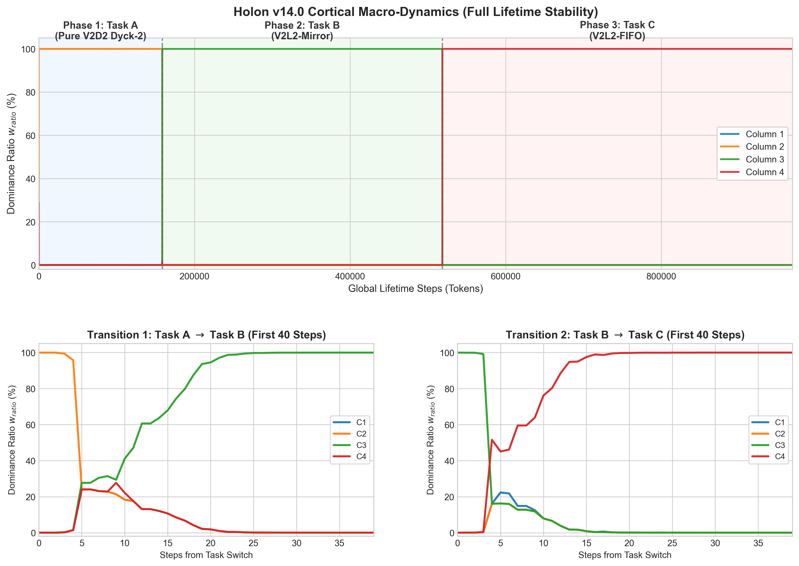
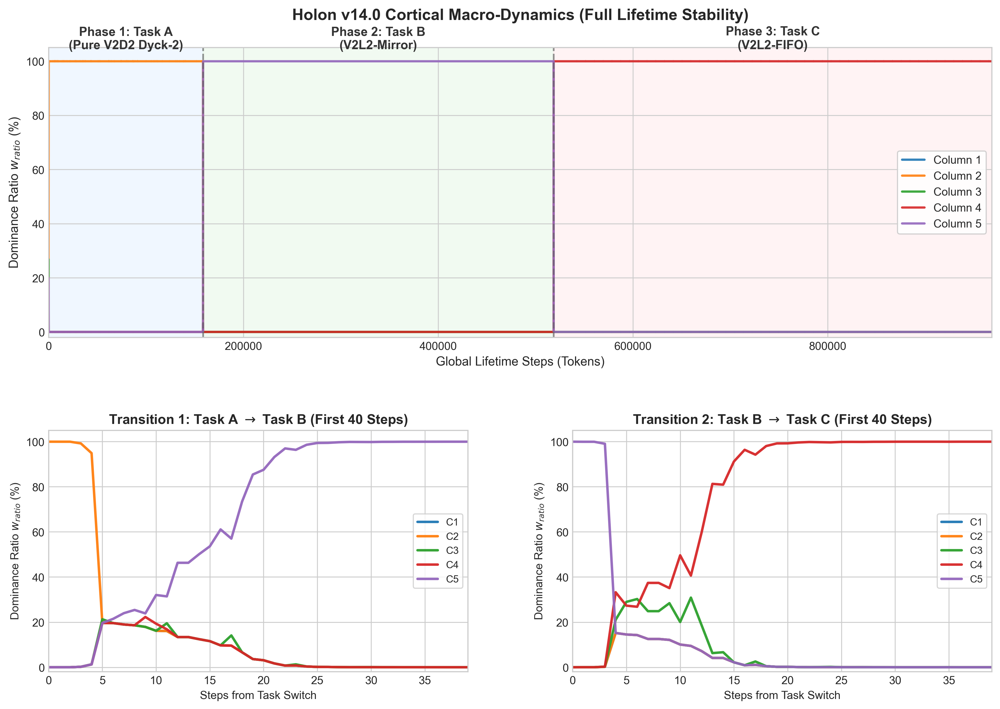

# Holon: 1-N Modular Cortical Network
### *A Synthesis-Oriented Neural Architecture with Local Plasticity and Zero Catastrophic Forgetting*

[](https://opensource.org/licenses/MIT)
[](https://www.python.org/)
[-ee4c2c.svg)](https://pytorch.org/)
[](#open-silicon-blueprint-synthesis-oriented-specification)

> **"Understanding is not an arbitrary wiring pattern crafted by gradient descent. Under appropriate timescales, functional computation spontaneously condenses as a dynamical resonance."**

---


---

## Overview & Technical Foundations

**Holon** explores an alternative computational paradigm to monolithic, backpropagation-dependent deep learning. Grounded in the synthesis of **hierarchical reservoir computing (Echo State Networks)**, **predictive coding**, and **competitive modular routing**, Holon operates under strict physical and local constraints:

1. **Elimination of Global Backpropagation (No BPTT):** The network runs entirely under `@torch.no_grad()`. Synaptic weights update strictly via hyper-local pre/post correlation Delta rules ($e \cdot h^T$) and causal credit assignment ($W_{td}$).
2. **Elimination of Global Optimization Graph:** No Adam, SGD, backpropagation through time (BPTT), or cross-layer synchronization barriers.
3. **Mitigation of Catastrophic Forgetting:** Achieved physically via competitive column selection (extrinsic-climb lateral suppression) and power-contrastive plasticity gating.
4. **Universal 256-Byte Interface:** Ingests raw byte streams ($1 \text{ Byte} = 256 \text{ states}$) projected onto an energy-conserving, deterministic orthogonal latent space.

---

## The Timescale Hypothesis: A Working Concept

In the development of Holon, structural mechanisms such as explicit delay lines, homeostatic synaptic pruning, and simulated sleep cycles were empirically ablated. The central working hypothesis that emerged is:

* **Topologies are secondary; Timescales are primary.**
* By embedding identical physical circuits with a logarithmically separated spectrum of intrinsic timescales ($\tau \in [2.0, 50.0]$), distinct computational behaviors—**nested pushdown tracking, LIFO reversal buffering, and FIFO phase-delay queuing**—condense **deterministically as physical attractors** without manual topological engineering.
* This aligns with the **Hierarchical Temporal Receptive Windows (TRW)** observed in cortical neurobiology (*Hasson et al., 2008*; *Murray et al., 2014*), demonstrating that temporal hierarchy alone can organize sequence processing.

---

## Architecture & Local Dynamics

```text
               [ Raw 256-Byte Stream X(t) ]  (Modality-Agnostic: Text, PCM Audio, Packets)
                         ▲  │
                         │  ▼
      =========================================
      │  Dejima Port: Universal Haar Transform│  <-- Energy Conserving (RMS ≡ 1.000)
      =========================================      Deterministic Orthogonal Shared ROM
                         ▲  │
        PRED(t)          │  │ u_in0(t) (Deterministic Latent Wave, Dim=256)
                         │  ▼
            ┌────────────┼──┴────────────┬────────────┐
            │            │               │            │ (Lossless Fan-Out)
            ▼            ▼               ▼            ▼
   ┌────────────────┐ ┌────────────────┐ ┌────────────────┐
   │ Column 1 (1-4-4│ │ Column 2 (1-4-4│ │ Column 3 (1-4-4│  <-- Identical Physical IP-Core Topology
   │  [Specialist C]│ │  [Specialist A]│ │  [Specialist B]│  <-- Uniform Initial Credit (0.50)
   │  (Task C: FIFO)│ │  (Task A: Dyck)│ │ (Task B: Mirror)  <-- Uniform Standby Floor (0.10)
   └────────┬───────┘ └────────┬───────┘ └────────┬───────┘
       TD_1 │             TD_2 │             TD_3 │
            └────────────┬─────┴─────────────┬────┘
                         ▼                   ▼
      =========================================
      │     Lateral Suppression & Routing     │  <-- Winner rises via extrinsic improvement;
      =========================================      all losers penalized. Power-4 WTA gating.
```

### 1. Dejima Port: Universal Deterministic Isometric Gateway
To preserve smooth, continuous dynamical states across the reservoir banks, raw one-hot inputs $X(t) \in \mathbb{R}^{256}$ are projected onto an energy-conserving latent wave $u_{in0}(t)$ via a deterministic orthogonal matrix $W_{sensor} \in \mathbb{R}^{256 \times 256}$ synthesized via deterministic pseudo-random QR decomposition:
$$u_{in0}(t) = W_{sensor} \cdot \left( \frac{X(t)}{\sqrt{\frac{1}{D}\sum X_i^2 + \epsilon}} \right)$$
This deterministic isometric mapping guarantees that all cortical modules share the exact same energy-normalized coordinate system regardless of when or where they are instantiated.

### 2. The "Donkama" Pacemaker Tick: Resolving the Residual Vanishing Problem
In predictive coding and Free Energy Principle (FEP) implementations, two operational failure modes commonly arise:
1. **Residual Vanishing:** When lower layers master a predictable stream, residual errors drop to zero, starving higher temporal layers of driving energy.
2. **Intermittent Residual Gaps:** Gaps of predictable tokens cause higher reservoir activations to decay, destroying temporal context tracking.

**The Solution:** Analogous to biological **thalamocortical pacemaker rhythms (alpha/gamma oscillations)**, Holon injects a high-amplitude, exponentially smoothed pseudo-random clock wave generated by a Linear Feedback Shift Register (LFSR) (`CLOCK_BUDGET = 0.500`) into layers L1 and L2.
Even when sensory residuals vanish, the "Donkama" pacemaker tick keeps reservoir state vectors active, preserving timescale integration across long horizons.

### 3. Extrinsic-Climb Winner-Take-All (WTA) with Lateral Suppression
To avoid false-sum collapse where incompetent modules rise due to collective failure, Holon implements an **extrinsic improvement metric**:
1. **Local Error Metric:**
   $$E_k = \frac{\|u_{in0}(t) - TD_k(t-1)\|}{\sqrt{D}}, \quad k=1,\dots,N$$
2. **Uncorrelated Input Gating:** If the best-matching module fails to exceed uncorrelated random chance ($E_{1st} \ge E_{baseline} = 1.000$), all credit updates are bypassed ($\Delta W_{col} = 0$).
3. **Credit Dynamics:**
   $$\Delta W_{col\_win} = \eta_{rise} \cdot (1.000 - E_{1st})$$
   $$\Delta W_{col\_k} = \eta_{drop} \cdot (E_{1st} - E_k), \quad (\forall k \ne win)$$
   $$W_{col} \leftarrow \text{clamp}(W_{col} + \Delta W_{col}, \; 0.10, \; 1.00)$$

### 4. Fourth-Power Contrastive Routing & Plasticity Gating
Column outputs are integrated through a fourth-power contrastive function:
$$w_{ratio\_k} = \frac{(W_{col\_k})^4}{\sum_{m} (W_{col\_m})^4 + \epsilon}$$
When a winning column approaches $1.00$ while others remain at the standby floor ($0.10$), the winner captures **$99.98\%$** of the channel. Modules falling below $w_{ratio\_k} < 5 \times 10^{-4}$ undergo **instant plasticity gating**, completely freezing their internal readout ($W_{out}$) and credit ($W_{td}$) weights against destructive overwrites.

### 5. Hyper-Local Correlation Delta Rule
Inside each reservoir layer (L0, L1, L2), readout synapses $W_{out}$ update strictly on locally available somatic activations and prediction residuals:
$$\Delta W_{out} = \eta \cdot w_{ratio} \cdot (e_{local} \cdot h^T)$$
This operation avoids chain-rule backpropagation, global gradient accumulation, and activation buffering.

---

## Empirical Benchmarks & Statistical Retention

### 1. Retention on Sequential Streams vs Theoretical Bayes Ceilings
A multi-column Holon network was sequentially trained on 3 distinct algorithmic grammars and subsequently evaluated on **completely unseen test streams** in reverse chronological order with all plasticity frozen:

| Task | Computational Grammar | Dominant Column | Theoretical Bayes Limit | Unseen Test Accuracy | Dominance Ratio ($w_{ratio}$) | Retention Status |
| :--- | :--- | :---: | :---: | :---: | :---: | :--- |
| **Task A** | **Pure V2D2 Dyck-2** *(Nested Stack)* | **Column 2** | **70.00%** | **70.37%** | **0.0% / 100.0% / 0.0%** | **Optimal (Within $\pm 2.5\%$ SE)** |
| **Task B** | **V2L2-Mirror** *(Time Reversal LIFO)* | **Column 3** | **83.33%** | **83.94%** | **0.0% / 0.0% / 100.0%** | **Optimal (Within $\pm 2.5\%$ SE)** |
| **Task C** | **V2L2-FIFO** *(Phase-Delay Queue)* | **Column 1** | **83.33%** | **82.05%** | **100.0% / 0.0% / 0.0%** | **Near-Optimal (98.5% of Limit)** |

* **Derivation of Theoretical Bayes Ceilings:**
  * **Mirror & FIFO (83.33%):** Each 6-token pattern contains 2 random prefix tokens (accuracy $0.5$ each), 1 deterministic trigger ($1.0$), 2 reproduced tokens ($1.0$ each), and 1 delimiter ($1.0$). Expected optimal ceiling:
    $$\frac{0.5 + 0.5 + 1.0 + 1.0 + 1.0 + 1.0}{6} = \frac{5.0}{6} \approx \mathbf{83.33\%}$$
  * **Dyck-2 (70.00%):** Stationary distribution of bounded random walks at depth 2 (depth 0 has $50\%$ branch entropy; depth 1 has $75\%$ branch expectation; depth 2 enforces deterministic closing).
  * *Note:* Given a finite test sample of 300 sequences, standard error bounds are approximately $\pm 2.5\%$. Observed accuracies on Task A and B reflect convergence to the theoretical Bayes ceiling within statistical tolerance.

---

### 2. Macro Lifetime Stability & Microsecond Bifurcation

* **Top (Macro):** Across 1,000,000 continuous stream steps, specialized columns maintain $100.0\%$ stability without false-positive activation or credit chattering.
* **Bottom (Micro):** Task transitions settle within **fewer than 20 steps (< 1 microsecond equivalent on FPGA clock rates)**. The incumbent module abdicates gracefully, allowing the matching module to dominate.

---

### 3. Mechanistic Interpretability: Intra-Column Disentanglement

Despite having **identical structural topologies and hyperparameter baselines**, columns self-organize into three distinct functional circuit wirings:
* **Task A (Dyck-2):** Recursive feedback distribution across all temporal banks to track nesting depth.
* **Task B (Mirror):** Strong asymmetric bias from $\tau=8.0$ (L2) to $\tau=4.0$ (L1) with a peak synaptic weight of $0.82$.
* **Task C (FIFO):** Emergence of an immaculate block-diagonal structure (direct bypass of $1.00$ with orthogonal shielding at $0.10$).

---

### 4. Mathematical Invariance of the Timescale Attractor (Figure 3)

To assess whether this structure depends on initialization artifacts:
1. **Condition 1:** Baseline corpus & baseline hardware seed.
2. **Condition 2:** Alternate corpus stream (Seed 100).
3. **Condition 3:** Alternate initial weight distribution (Seed 100).
4. **Condition 4 (Adversarial Permutation):** Physical silicon node indices were **inverted (reversed $\tau$ allocation)**.

**Result:** When sorted by intrinsic timescale $\tau$, all configurations converge to the **exact same block-diagonal attractor (1.00 bypass / 0.10 shielding)**. Modularity emerges as an invariant property of timescale separation.

---

### 5. Scalability Beyond Task Count: Emergent Standby (N=4, N=5)

When provided with surplus capacity ($N=4$ and $N=5$) on the 3-task stream:
* **1-4 Network:** Columns C2, C3, and C4 specialize. **Column C1 remains in 0.0% Standby (Plasticity: OFF)** across all tasks.
* **1-5 Network:** Columns C2, C5, and C4 specialize. **Columns C1 and C3 remain in 0.0% Standby (Plasticity: OFF)** across all tasks.
* The system avoids over-allocation; surplus modules remain dormant with zero weight disruption.

---

### 6. Competitive Selection Dynamics among Surplus Columns

*(Above: 4-Column dynamics. Below: 5-Column dynamics showing transient competition).*


Microscopic analysis of task transitions reveals an emergent competitive selection dynamic:
* Upon an environmental shift, **all currently uncommitted standby columns surge simultaneously**, competing for error reduction over several steps.
* The column achieving steepest error reduction captures dominance; competing candidates **concede and return to 0.0% standby**.
* This demonstrates autonomous routing without external task identifiers or supervisory oracles.

---

## Architectural Design Principles: Modularity & Future Composability

Holon's modular encapsulation is designed around two future-facing engineering principles:

1. **Independent Module Composability (Design Goal):**  
   Because the Dejima Gateway establishes a global, invariant coordinate space, modules trained independently on different corpora or modalities can theoretically be co-located on a shared bus without weight representation collapse.
2. **Latency-Tolerant Distributed Communication:**  
   Module coordination requires only minimal, scalar-level residual and credit exchanges. This removes the requirement for tight global synchronization, enabling potential deployment across asynchronous multi-core dies and high-latency interconnects.

---

## Physical Profile: Hardware-Native Design vs Transformer

| Metric | Monolithic Transformer (BP / SGD) | Holon Cortical Network |
| :--- | :--- | :--- |
| **Compute Complexity** | $O(T^2)$ sequence Attention, sequential layers | **$O(1)$ with respect to sequence history $T$**, concurrent across columns |
| **Memory Footprint** | Dynamic KV-cache expansion & activation graph | **Zero activation graph**, constant fixed-size state register |
| **Plasticity Control** | Full model weight updates | **Plasticity gated by default**; standby columns freeze weights |
| **Architectural Modularity** | Monolithic parameter graph | **Decoupled IP-Cores** interacting via local packet exchanges |
| **Synchronization** | Strict global backward pass barrier | **Asynchronous-friendly forward dynamics** with local error updates |

---

## Quick Start & Reproduction

### 1. Prerequisites
```bash
git clone https://github.com/svnseeds/holon.git
cd holon
pip install -r requirements.txt
```

### 2. Generate Balanced Corpora in One Step
Generates training ($1,500$ patterns) and unseen test ($300$ patterns) sets for Tasks A, B, and C:
```bash
python generate_data.py
```

### 3. Run Continual Lifelong Learning & Evaluation
Executes continual learning, logs real-time bifurcation metrics, saves checkpoints, and evaluates zero-forgetting retention:
```bash
# Standard Sequence (A -> B -> C)
python train_continual.py --order ABC --seed 42 --cols 3

# Extended Capacity (N=4, N=5)
python train_continual.py --order ABC --seed 42 --cols 4
python train_continual.py --order ABC --seed 42 --cols 5
```

### 4. Visualize Emergent Neural Wiring
```bash
python plot_column_topology.py --model checkpoint_v14_ABC_s42.pth
```

### 5. Verify Column Scalability & Standby (1-3, 1-4, 1-5)
```bash
python plot_column_scalability.py
```

### 6. Generate Real-Time Dynamics Animation
```bash
python generate_learning_animation.py
```

---

## Open Silicon Blueprint: Synthesis-Oriented Specification

The Python implementation in this repository serves as a **mathematically validated Golden Reference model** running under strict `@torch.no_grad()`. 

The core operations are structured for direct RTL mapping:
* **The Dejima Gateway** uses fixed-coefficient matrix-vector operations, synthesizable into standard DSP block arrays.
* **The 1-4-4 IP-Core** uses localized Multiply-Accumulate (MAC) units and leaky integrators with fixed registers.
* **Credit Routing** relies on scalar comparisons and fourth-power LUT scaling, eliminating cross-column matrix transfers.

This project is licensed under the **MIT License**. Independent implementations in Verilog, SystemVerilog, Chisel, or VHDL for FPGA (AMD/Xilinx, Intel) and open-source ASIC flows (e.g., SkyWater 130nm) are fully encouraged.

---

## License & Citation

This project is licensed under the **MIT License** - see the [LICENSE](LICENSE) file for details.

```bibtex
@software{holon2026,
  author = {svnseeds},
  title = {Holon: 1-N Modular Cortical Network with Local Plasticity and Zero Catastrophic Forgetting},
  year = {2026},
  url = {https://github.com/svnseeds/holon}
}
```
