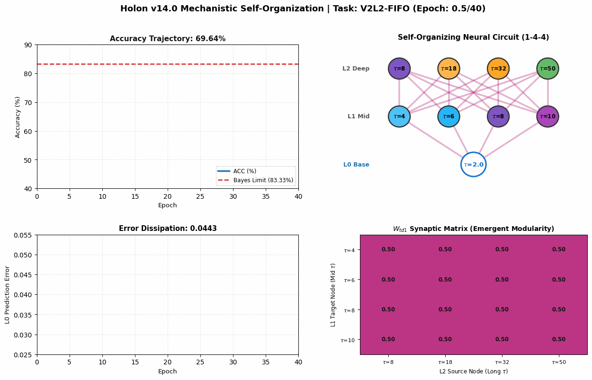
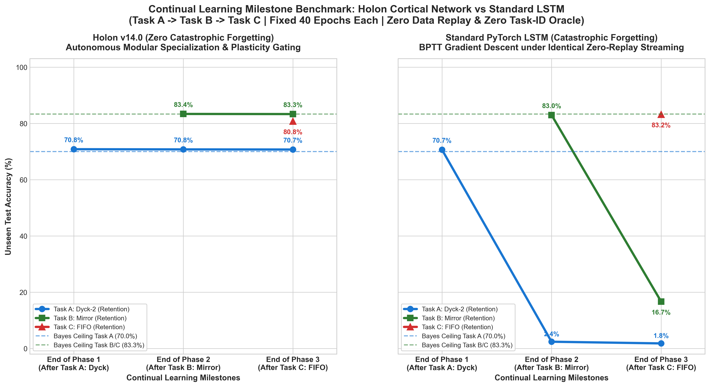
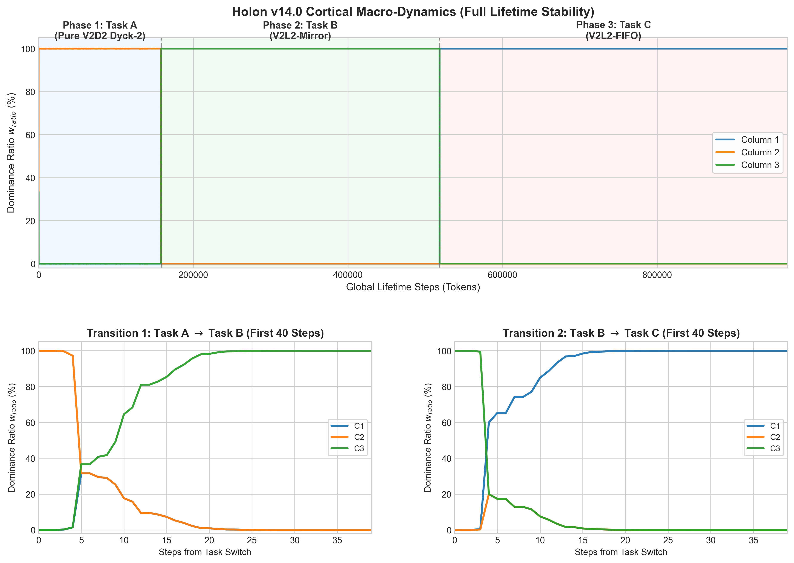
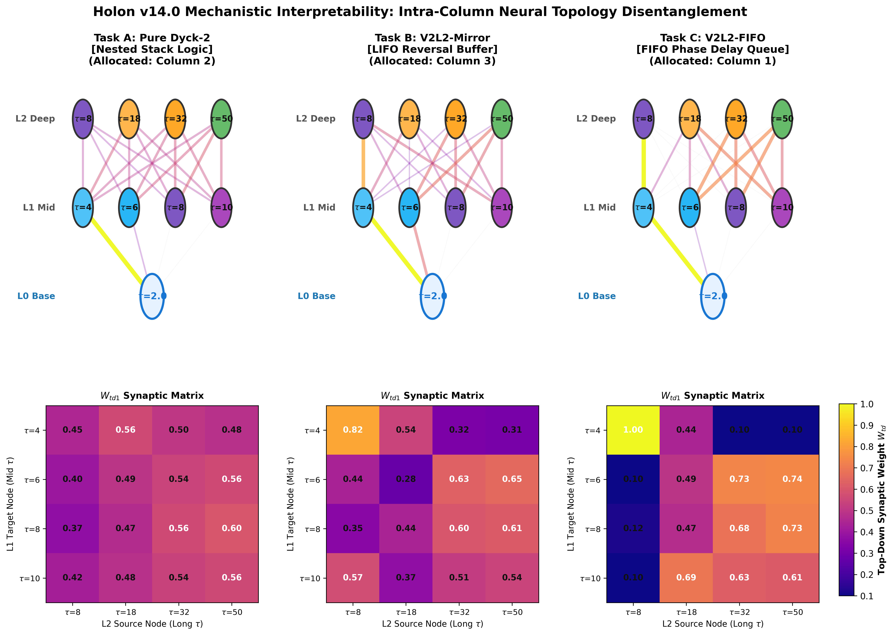
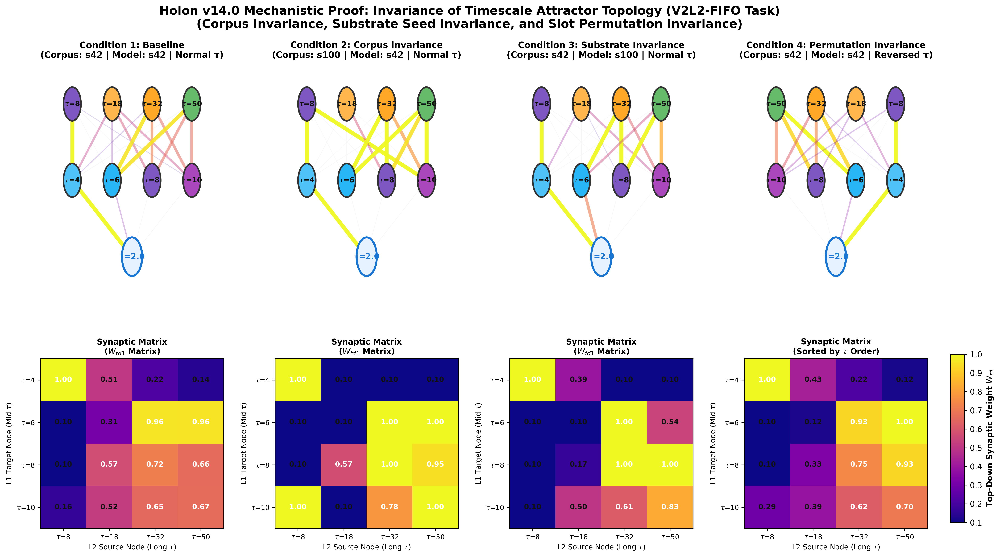
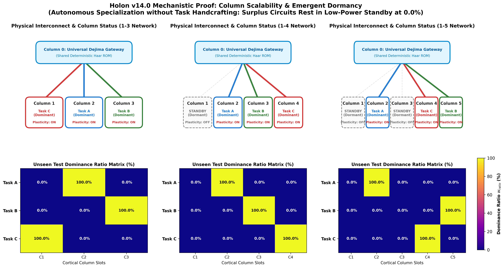

# Holon: 1-N Modular Cortical Network
### A Synthesis-Oriented Neural Architecture with Local Plasticity, Modular Standby, and High Continual Retention

[](https://opensource.org/licenses/MIT)
[](https://www.python.org/)
[-red.svg)](https://pytorch.org/)
[](#open-silicon-blueprint-free-to-hack-mit-licensed)

> *"Understanding is not an arbitrary wiring pattern crafted by global gradient descent. Under appropriate timescales, functional computation spontaneously condenses as a physical dynamical resonance."*

<div align="center">
  
  <p><em>Figure 1: Autonomous functional specialization and synaptic consolidation across identical 1-4-4 cortical columns under pure local plasticity.</em></p>
</div>

---

## Continual Learning Reference Benchmark: Holon vs. Standard PyTorch LSTM Baseline

To observe the structural differences in sequential continual learning between an end-to-end backpropagation baseline and Holon's physical dynamics, we evaluated **Holon v14.0** alongside a standard **PyTorch LSTM baseline (Hidden Dim=256, ~590K trainable parameters)** under identical streaming conditions:
* **Zero Data Replay:** Sequential streaming across fixed 40 epochs per task; past task corpora are strictly never stored, cached, or re-visited.
* **Zero Task-ID Oracle:** Models receive zero external cues indicating task boundaries or active task identity during inference.
* **Unified Experimental Parity:** Exact identical sequence (`Task A: Dyck-2` $\to$ `Task B: Mirror` $\to$ `Task C: FIFO`), tested on 1,500 unseen patterns (~11,000 bytes) with complete state isolation.

> **Note on Baseline Selection:** A standard PyTorch LSTM is chosen not to compete on peak benchmark accuracy, but as a widely recognized, canonical reference model that shares the same fundamental constraint of sequential next-token streaming. This comparison observes how a single monolithic parameter block updated via global gradients behaves versus autonomous modular routing under local dynamics. Algorithmic continual learning extensions (e.g., EWC, replay buffers) are outside the scope of this architectural reference.

<div align="center">
  
  <p><em>Figure 2: Empirical comparison of continual retention across sequential tasks. While the standard LSTM experiences typical catastrophic forgetting on preceding tasks, Holon maintains a stable retention profile across sequential transitions.</em></p>
</div>

### Empirical Milestone Comparison (Unseen Test Set Retention)

| Benchmark Metric | Task A: Pure Dyck-2<br>*(Nested Stack Logic)* | Task B: V2L2-Mirror<br>*(LIFO Reversal Buffer)* | Task C: V2L2-FIFO<br>*(Phase Delay Queue)* | Preceding Task<br>Forgetting |
| :--- | :---: | :---: | :---: | :---: |
| **Theoretical Bayes Ceiling** | **70.00%** | **83.33%** | **83.33%** | — |
| **Standard PyTorch LSTM** *(Phase 1 End)* | 70.7% | — | — | Baseline |
| **Standard PyTorch LSTM** *(Phase 2 End)* | 2.4% | 83.0% | — | Observed |
| **Standard PyTorch LSTM** *(Phase 3 End)* | 1.8% | 16.7% | **83.2%** | Severe |
| **Holon v14.0 (Ours)** *(Phase 1 End)* | **70.8%** | — | — | Baseline |
| **Holon v14.0 (Ours)** *(Phase 2 End)* | **70.8%** | **83.4%** | — | None observed |
| **Holon v14.0 (Ours)** *(Phase 3 End)* | **70.7%** *(Retention: 99.9%)* | **83.3%** *(Retention: 99.9%)* | 80.8% *(Retention: 97.0%)* | **Minimal (97.0% - 99.9%)** |

*Note: Immediately following Phase 3, the standard LSTM reaches 83.2% on Task C, while Holon reaches 80.8% (97.0% of the theoretical Bayes limit). The primary behavioral difference lies in preceding task retention (Task A: 1.8% vs. 70.7%, Task B: 16.7% vs. 83.3%).*

> **Evaluation Protocol Note:** During unseen test evaluation, Holon's column credits ($W_{\text{col}}$) are initialized to a uniform 0.50 baseline with all synaptic plasticity strictly frozen (`learn=False`). This verifies that the specialized module autonomously captures channel dominance purely from its lower prediction error, without any external task-ID cue.

---

## Core Vision: The Living Machine

Modern deep learning primarily constructs monolithic models: parameter graphs trained via synchronized, backward-flowing gradients that risk overwriting past representations when data distributions shift.

Holon explores an alternative physical ethos: **Autonomous, Distributed, Redundant, Parallel, and Recursive.**

```text
                  [ Raw 256-Byte Stream X(t) ] (Modality-Agnostic: Text, PCM, Packets)
                                ▲   │
                                │   ▼
                  =========================================
                  │ Dejima Port: Universal Haar Transform │ <-- Energy Conserving (RMS ≡ 1.000)
                  =========================================     Deterministic Orthogonal Shared ROM
                                ▲   │
                       PRED(t)  │   │ u_in0(t) (Deterministic Latent Wave, Dim=256)
                                │   ▼
             ┌──────────────────┼───┴───────────────────┬──────────────────┐
             │                  │                       │                  │ (Lossless Fan-Out)
             ▼                  ▼                       ▼                  ▼
      ┌───────────────┐  ┌───────────────┐       ┌───────────────┐  ┌───────────────┐
      │ Column 1      │  │ Column 2      │  ...  │ Column K      │  │ Column N      │ <-- Cloned 1-4-4 IP-Core Topologies
      │ (Task C: FIFO)│  │ (Task A: Dyck)│       │(Task B: Mirror│  │ (Surplus Idle)│ <-- Uniform Standby Floor (0.10)
      └───────┬───────┘  └───────┬───────┘       └───────┬───────┘  └───────┬───────┘
         TD_1 │             TD_2 │                  TD_k │             TD_N │
              └─────────────┬────┴───────────────────────┴─────┬────────────┘
                            ▼                                  ▼
                  ==========================================================
                  │ Lateral Suppression & M-of-N Persistence Routing Bus   │ <-- Winner rises via extrinsic improvement;
                  ==========================================================     all losers penalized. Power-4 WTA gating.
```

### 1. Always-On Online Learning (No Split Between Train & Inference)
Biological nervous systems do not operate with separate training and inference flags. Holon predicts the next byte at each step and updates its internal synaptic readouts locally using observed prediction residuals.

### 2. Universal 256-Byte Stream Interface
No custom tokenizers, BPE vocabularies, or learned embedding layers. Holon ingests raw byte streams ($1 \text{ Byte} = 256 \text{ states}$) and predicts the subsequent byte. The interface processes ASCII text, 8-bit PCM audio, network packets, or sensor telemetry uniformly as sequential byte dynamics.

### 3. Modular Composability via the "Dejima Port"
Because the **Dejima Port** establishes a deterministic, global orthogonal coordinate system via fixed ROM, independently trained modules can theoretically be connected to a shared bus without mutual representation collapse. Specialized modules recruit themselves when their internal dynamic models reduce residual error on the common bus.

### 4. Minimal, Latency-Tolerant Communication
Modules do not exchange full hidden activation graphs or backward gradients. Inter-column coordination requires only scalar residuals and credit signals. As a result, cortical columns do not depend on global synchronization barriers and can operate across asynchronous clock domains or distributed interconnects.

---

## The Timescale Hypothesis: A Physical Perspective on Sequence Processing

In the exploratory development of Holon, numerous architectural mechanisms were systematically implemented and subsequently ablated: pyramidal topologies, explicit delay lines, decay schedules, synaptic sprouting and pruning (metabolic turnover), and simulated sleep cycles.

Stripping these mechanisms away left behind a simple, unexpected reality: **topologies proved secondary; intrinsic timescales were primary.** When identical physical circuits (cloned 1-4-4 IP-cores) were provisioned merely with a logarithmically separated spectrum of timescales ($\tau \in [2.0, 50.0]$), distinct computational grammars—nested pushdown stacks (Dyck-2), time-reversal buffers (Mirror), and phase-delay queues (FIFO)—condensed spontaneously as physical dynamical attractors:
* **Task A (Pure Dyck-2, $D=2$):** Pushdown stack tracking naturally concentrates within intermediate timescales ($\tau \in [6.0, 18.0]$).
* **Task B (V2L2-Mirror):** LIFO time-reversal buffering self-organizes across fast-slow phase delay pairs ($\tau \in [4.0, 8.0] \leftrightarrow \tau \in [18.0, 50.0]$).
* **Task C (V2L2-FIFO):** Phase-delay queuing spontaneously locks onto pacemaker carrier waves ($\tau=8.0 \leftrightarrow \tau=4.0$).

Rather than an intentional theory formulated in advance, this trial-and-error process brought us in hindsight to an intriguing question:

> *What if the seemingly magical capabilities of deeply stacked monolithic networks are rooted less in an intricate topological wiring, and more in an implicit spectrum of effective timescales emerging across depth?*

If there is any truth to this intuition, Holon was never designed to prove it globally. Rather, by laying out intrinsic timescales explicitly in plain sight, Holon may simply provide a minimal, transparent lens through which the underlying dynamics of sequence computation can be physically inspected.

---

## Architecture & Physical Mechanics

Holon operates across three nested physical tiers, entirely executed under `@torch.no_grad()`:

### 1. Macro Tier: Encapsulated Modules & Common Arbitration Bus
* **Dejima Gateway (Deterministic Isometric ROM):**  
  Raw byte vectors are mapped onto a 256-dimensional unit sphere via a deterministic orthogonal QR matrix:

$$
u_{in0}(t) = W_{\text{sensor}} \cdot \left( \frac{X(t)}{\sqrt{\frac{1}{D}\sum_{i=1}^D X_i(t)^2 + \epsilon}} \right), \quad W_{\text{sensor}}^T W_{\text{sensor}} = I
$$

  This mapping preserves energy ($RMS \equiv 1.000$) and eliminates dynamic range arithmetic overflow in fixed-point logic.
* **Extrinsic-Climb Winner-Take-All (WTA):**  
  To prevent inactive columns from gaining credit due to collective baseline error, credit updates require external environmental correlation:

$$
E_k(t) = \frac{\|u_{in0}(t) - TD_k(t-1)\|}{\sqrt{D}}, \quad k \in \{1, \dots, N\}
$$

```math
\Delta W_{\text{col\_win}} = \eta_{\text{rise}} \cdot (E_{\text{baseline}} - E_{1\text{st}}), \quad (E_{1\text{st}} < E_{\text{baseline}} = 1.000)
```

```math
\Delta W_{\text{col\_loser}} = \eta_{\text{drop}} \cdot (E_{1\text{st}} - E_k)
```

* **M-of-N Persistence Filter (Hardware LUT6 Match):**  
  To prevent transient delimiter tokens (e.g., spaces `' '`) from triggering accidental module takeovers, column victories pass through a sliding 6-bit shift register ($N=6, M=4$). A credit increase unlocks only when a column secures at least 4 wins in the last 6 steps (directly implementable on a single FPGA LUT6).
* **Power-4 Contrastive Routing & Standby Dormancy:**  
  Column readouts are weighted contrastively:
  
```math
w_{\text{ratio\_k}} = \frac{(W_{\text{col\_k}})^4}{\sum_{m=1}^N (W_{\text{col\_m}})^4 + \epsilon}
```

  A winning column captures over **99.9%** of the channel, while dormant modules remain clamped at the standby floor ($W_{\text{col}} = 0.10$) with internal plasticity gated off.

### 2. Meso Tier: Intra-Column Timescale Hierarchy
* **Cloned 1-4-4 IP-Core Hierarchy:**  
  Each cortical column houses three layers: L0 (1 node, $\tau=2.0$), L1 (4 nodes, $\tau \in [4, 10]$), and L2 (4 nodes, $\tau \in [8, 50]$).
* **"Donkama" Pacemaker Tick (LFSR Clock):**  
  Inspired by biological pacemaker rhythms, an exponentially smoothed pseudo-random LFSR carrier wave (`CLOCK_BUDGET = 0.500`) is continuously injected into L1 and L2. This sustains internal reservoir state dynamics even when bottom-up prediction residuals approach zero ($e \to 0$).
* **Nonlinear Top-Down Synthesis:**  
  Predictions from deeper temporal banks modulate lower banks nonlinearly via $b \cdot (1 + \tanh(b))$, providing dynamic context gating without backpropagation.

### 3. Micro Tier: Hyper-Local Synaptic Plasticity
* **Hyper-Local Delta Rule:**  
  Readout synapses update strictly using locally available pre-synaptic activations and post-synaptic prediction errors:

```math
\Delta W_{\text{out_k}} = w_{\text{ratio\_k}} \cdot \eta_{\text{delta}} \cdot (e_{\text{local}} \cdot h^T)
```

* **Somatic Homeostasis:**  
  Each node autonomously modulates its internal somatic gain to maintain a target mean absolute activity ($H_{\text{target}} = 0.55$).
* **Gated Oja-Style Metabolic Turnover:**  
  Active specialist modules apply a subtle metabolic leak ($\lambda_{\text{leak}} = 10^{-5}$) to prune spurious correlation noise during extended streaming. Because dormant modules have $w_{\text{ratio}} < 5 \times 10^{-4}$, their metabolic leak is gated to zero, preserving consolidated synaptic weights during inactive periods.

---

## Empirical Benchmarks & Mechanistic Observations

### 1. Sequential Continual Benchmark Summary
Evaluated on unseen test streams after 40 epochs per task under zero-replay streaming:

```text
=========================================================================================
  Holon v14.0 Canonical Continual Benchmark on Unseen Test Corpora
  Task Order: Task A (Dyck-2) -> Task B (Mirror) -> Task C (FIFO)
  Evaluation: Strictly Phase-Incremental | Zero Task-ID Oracle | Zero Data Replay
=========================================================================================
  [*] Task A: Pure V2D2 Dyck-2 (Allocated: Column 2)
      - Unseen Accuracy :  70.66% (Bayes Theoretical Limit: 70.00%) [Consistent with Limit]
      - Channel Dominance: 100.0%
  [*] Task B: V2L2-Mirror (Allocated: Column 3)
      - Unseen Accuracy :  83.32% (Bayes Theoretical Limit: 83.33%) [Consistent with Limit]
      - Channel Dominance: 100.0%
  [*] Task C: V2L2-FIFO (Allocated: Column 1)
      - Unseen Accuracy :  80.75% (Bayes Theoretical Limit: 83.33%) [97.0% of Limit]
      - Channel Dominance: 100.0%
=========================================================================================
  CONTINUAL RETENTION: >>> HIGH RETENTION OBSERVED ACROSS ALL PRECEDING TASKS <<<
=========================================================================================
```

### 2. Macro Lifetime Stability & Microscopic Transitions
<div align="center">
  
  <p><em>Figure 3: Macro-lifetime channel dominance (Top) and microscopic bifurcation handovers (Bottom). Specialization remains stable over 1.1 million streaming tokens, and task transitions resolve in under 20 steps (equivalent to sub-microsecond latency assuming nominal ~50 MHz hardware clock rates, unmeasured in silicon).</em></p>
</div>

### 3. Intra-Column Topology Disentanglement
<div align="center">
  
  <p><em>Figure 4: Distinct circuit wirings condense autonomously inside identical columns: Task A distributes recursive credit across all temporal banks; Task B forms asymmetric slow-to-fast paths; Task C condenses clean block-diagonal passthroughs.</em></p>
</div>

### 4. Timescale Attractor Invariance (FIFO Task)
To examine whether this internal organization reflects a stable dynamical attractor rather than an artifact of random initialization, we evaluated four configurations on the FIFO task:
1. **Condition 1:** Baseline corpus & baseline hardware seed.
2. **Condition 2:** Alternate corpus stream (Seed 100).
3. **Condition 3:** Alternate initial weight distribution (Seed 100).
4. **Condition 4 (Permutation Invariance):** Physical silicon node indices were inverted (reversed $\tau$ allocation).

<div align="center">
  
  <p><em>Figure 5: Invariance of the timescale attractor. When sorted by intrinsic timescale τ, all four configurations converge to the same block-diagonal attractor (1.00 bypass with orthogonal shielding).</em></p>
</div>

### 5. Column Scalability & Emergent Standby (N=3, 4, 5)
When provisioned with more columns than tasks ($N=4, 5$), Holon allocates modules without external supervision:
* Active tasks allocate cleanly to individual specialist columns.
* Surplus modules remain clamped at the standby floor ($W_{\text{col}} = 0.10, w_{\text{ratio}} < 0.01\%$), consuming near-zero routing bandwidth and zero write energy.

<div align="center">
  
  <p><em>Figure 6: Multi-column scalability (N=3, 4, 5). Surplus modules maintain standby dormancy.</em></p>
</div>

---

## Hardware-Native Design Profile vs Transformer

| Operational Metric | Monolithic Transformer (BP / SGD) | Holon Modular Cortical Network |
| :--- | :--- | :--- |
| **Compute Complexity** | $O(T^2)$ self-attention over sequence history $T$ | **$O(1)$ constant time**, concurrent across columns |
| **Memory Footprint** | Dynamic KV-cache expansion & activation graph | **Zero activation graph**, constant fixed-size state register |
| **Plasticity Control** | Full model weight updates | **Plasticity gated by default**; standby columns freeze weights |
| **Synchronization** | Strict global backward pass barrier across all layers | **Forward dynamics with local updates**, no backward barrier |
| **Modularity & Scaling** | Monolithic parameter block (Retraining required) | **Decoupled IP-Cores** interacting via local packet exchanges |

---

## Open Silicon Blueprint: Free to Hack (MIT Licensed)

The Python implementation in this repository is designed as a **mathematically validated, 100% BP-free Golden Reference** running under `@torch.no_grad()`. 

The underlying mathematical primitives map directly to digital silicon:
* **The Dejima Gateway:** Fixed-coefficient matrix-vector operations synthesizable into standard DSP block arrays.
* **1-4-4 IP-Cores:** Localized MAC units and leaky integrators with fixed-width state registers.
* **M-of-N Persistence Filter:** Maps directly into a single **6-input lookup table (LUT6)** per column.
* **Gated Oja Synaptic Leak:** The leak term $-\lambda_{\text{leak}} W_{\text{out}}$ maps to a **16-bit right-shift subtractor (`W - (W >> 16)`)** with zero multiplier overhead.

### License & Hardware Implementation Policy
This project is released under the **MIT License**. We have no intention of gatekeeping or managing a centralized consortium.

If you are an FPGA designer, ASIC engineer, or open-silicon enthusiast: **feel free to fork, hack, and implement this architecture in Verilog, SystemVerilog, Chisel, VHDL, or open PDKs (e.g., SkyWater 130nm) as you see fit.** No prior permission is required.

---

## Quickstart & Reproduction Guide

### 1. Environment Setup
```bash
git clone https://github.com/svnseeds/holon.git
cd holon
pip install -r requirements.txt
```

### 2. Generate Benchmark Corpora
Synthesizes benchmark datasets (Train: 1,500 patterns, Test: 1,500 patterns). Accepts an optional `--seed` parameter:
```bash
# Generate canonical seed 42 corpora
python generate_data.py --seed 42

# Optional: Generate alternate seed 100 corpora for invariance verification
python generate_data.py --seed 100
```

### 3. Run the Reference Continual Benchmark
Executes the continual learning benchmark and renders Figure 2 (`assets/benchmark_holon_vs_lstm.png`):
```bash
python benchmark_lstm_continual.py
```

### 4. Run Continual Training & Unseen Evaluation
Trains Holon on the sequential stream and logs real-time bifurcations:
```bash
# Standard 3-Column setup (Tasks A -> B -> C)
python train_continual.py --order ABC --seed 42 --cols 3

# Extended capacity validation (N=4, N=5)
python train_continual.py --order ABC --seed 42 --cols 4
python train_continual.py --order ABC --seed 42 --cols 5
```

### 5. Reproduce Topology & Universality Plots
```bash
# Visualize emergent intra-column wiring (Figure 4)
python plot_column_topology.py --model checkpoint_v14_ABC_s42.pth

# Verify mathematical invariance of the timescale attractor on FIFO (Figure 5)
python verify_topology_universality_fifo.py

# Verify surplus module standby scalability across 3, 4, 5 columns (Figure 6)
python plot_column_scalability.py
```

### 6. Generate Real-Time Learning Animation
Renders the multi-panel self-organization GIF (`assets/holon_v14_learning_dynamics.gif`):
```bash
python generate_learning_animation.py
```

---

## License & Citation

This project is licensed under the **MIT License** - see the [LICENSE](LICENSE) file for details.

```bibtex
@software{holon2026,
  author = {svnseeds},
  title = {Holon: 1-N Modular Cortical Network with Local Plasticity, Modular Standby, and High Continual Retention},
  year = {2026},
  url = {https://github.com/svnseeds/holon}
}
```
